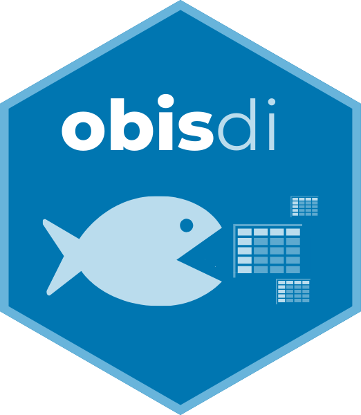
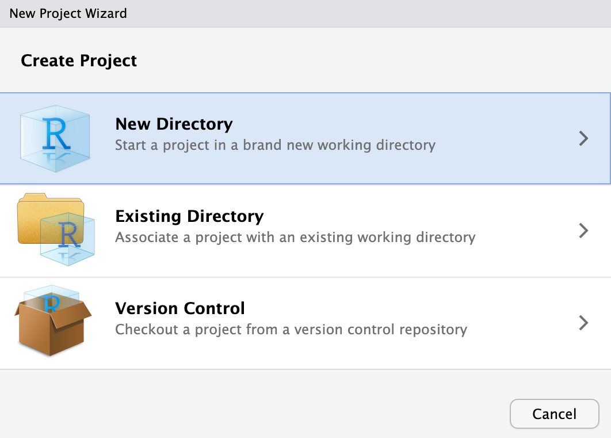
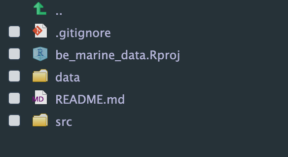

<!-- README.md is generated from README.Rmd. Please edit that file -->

# obisdi 

Marine biodiversity data ingestion for OBIS using a reproducible
workflow

<!-- badges: start -->
<!--

-->
<!-- badges: end -->

## Overview

This package is under development

## How to use

To install the package use…

### By setting a new project

After you installed the package, you can set up a new project which will
follow the standard of `obisdi`. In RStudio, fo to File \> New Project

Choose “New directory”

Then, select the **Marine Biodiversity data ingestion - OBIS** format

Supply the directory name (don’t use spaces or special characters!) and
the dataset name.

You can also select your raw data files to be included in the project.
For that use the “Data file” box. At this moment, the following formats
are accepted:

- `zip` files
- `csv` files

In case you supply a `zip` file it should be composed of *only* `csv`
files. You can also convert the files with more than 50MB into
lightweight `parquet` files by checking the box “Convert to parquet”.
This conversion is strongly advised as GitHub does not allow big files
to be uploaded (the limit is 100MB).

You may also skip this step and add your data manually on the “data/raw”
folder. There is also a function in the package for pre-processing data
(like converting to a lightweight format).

When the project is done, it will open a new session with the two main
files of the project: the `README.md` and the `Rmd` file for data
processing.

The folder is structured using the package standard and is ready to use

### Using the functions
